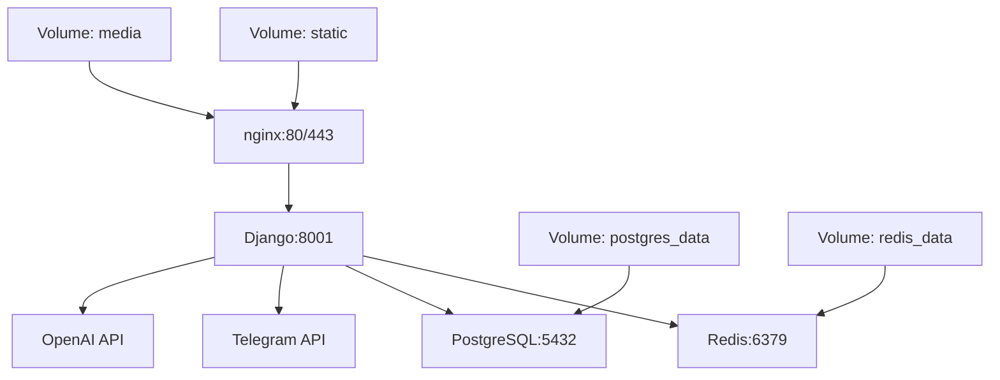

# 🐳 Docker Setup для МВЭУ Telegram Bot

## 📋 Полный список созданных файлов

### Основные Docker файлы
- `Dockerfile` - образ Django приложения
- `docker-compose.yml` - конфигурация для разработки
- `docker/docker-compose.prod.yml` - конфигурация для продакшн
- `.dockerignore` - исключения для Docker build
- `.env.example` - пример переменных окружения

### Скрипты и утилиты
- `docker/run.sh` - главный скрипт управления (исполняемый)
- `docker/entrypoint.sh` - скрипт запуска контейнера (исполняемый)
- `docker/healthcheck.sh` - проверка здоровья сервисов (исполняемый)

### Nginx конфигурация
- `docker/nginx.conf` - Nginx для разработки
- `docker/nginx.prod.conf` - Nginx для продакшн с SSL

### Документация
- `README.md` - полная документация проекта
- `DOCKER_SETUP.md` - этот файл

## 🚀 Быстрый старт

### 1. Предварительные требования
```bash
# Установка Docker (Ubuntu/Debian)
curl -fsSL https://get.docker.com -o get-docker.sh
sudo sh get-docker.sh

# Установка Docker Compose
sudo apt-get install docker-compose-plugin

# Добавление пользователя в группу docker
sudo usermod -aG docker $USER
newgrp docker
```

### 2. Запуск приложения
```bash
# Клонирование и переход в папку
cd /path/to/mveu-telegram-bot

# Настройка переменных окружения
cp .env.example .env
nano .env  # Отредактируйте токен бота и другие настройки

# Запуск с помощью утилиты
./docker/run.sh start

# Или напрямую через docker-compose
docker-compose up -d
```

### 3. Проверка статуса
```bash
# Статус сервисов
./docker/run.sh status

# Или
docker-compose ps
```

## 🏗️ Архитектура Docker



## 📦 Сервисы в Docker Compose

### 1. **web** (Django приложение)
- **Порт**: 8001
- **Зависимости**: redis, postgres (опционально)
- **Volumes**: static, media, код приложения
- **Health check**: проверка API endpoint

### 2. **redis** (Кэш и Channels)
- **Порт**: 6379
- **Назначение**: WebSocket соединения, кэширование
- **Volume**: redis_data (персистентность)

### 3. **postgres** (База данных)
- **Порт**: 5432 
- **Назначение**: основная БД (альтернатива SQLite)
- **Volume**: postgres_data
- **Profile**: postgres (запускается опционально)

### 4. **nginx** (Веб-сервер)
- **Порты**: 80, 443
- **Назначение**: reverse proxy, static files, SSL
- **Volumes**: static, media, SSL сертификаты

## 🔧 Управление сервисами

### Основные команды
```bash
# Все сервисы
./docker/run.sh start|stop|restart|status

# Просмотр логов
./docker/run.sh logs

# Пересборка образов
./docker/run.sh build

# Полная очистка (ОСТОРОЖНО!)
./docker/run.sh cleanup
```

### Продвинутые команды
```bash
# Запуск с PostgreSQL
docker-compose --profile postgres up -d

# Выполнение команд Django
docker-compose exec web python manage.py migrate
docker-compose exec web python manage.py createsuperuser
docker-compose exec web python manage.py collectstatic

# Вход в контейнер
docker-compose exec web bash

# Просмотр логов конкретного сервиса
docker-compose logs -f web
docker-compose logs -f redis
```

## 🌍 Переменные окружения

### Обязательные настройки
```env
TELEGRAM_BOT_TOKEN=your-bot-token  # От @BotFather
SECRET_KEY=50-character-secret     # Django secret
```

### Рекомендуемые настройки
```env
DEBUG=False                        # Для продакшн
ALLOWED_HOSTS=yourdomain.com       # Домен сайта
POSTGRES_PASSWORD=secure-password  # Пароль БД
REDIS_PASSWORD=secure-password     # Пароль Redis
OPENAI_API_KEY=sk-...             # Для ИИ функций
```

## 📊 Мониторинг и логи

### Просмотр статуса
```bash
# Статус всех контейнеров
docker-compose ps

# Использование ресурсов
docker stats

# Health check
./docker/healthcheck.sh
```

### Логи
```bash
# Все логи
docker-compose logs

# Логи в реальном времени
docker-compose logs -f

# Логи конкретного сервиса
docker-compose logs web
docker-compose logs redis
docker-compose logs postgres
```

## 💾 Управление данными

### Backup базы данных
```bash
# Создание backup
docker-compose exec postgres pg_dump -U mveu_user mveu_bot > backup.sql

# Восстановление
docker-compose exec -T postgres psql -U mveu_user mveu_bot < backup.sql
```

### Volumes
```bash
# Просмотр volumes
docker volume ls

# Backup volumes
docker run --rm -v mveu_postgres_data:/data -v $(pwd):/backup ubuntu tar czf /backup/postgres_backup.tar.gz /data

# Удаление volumes (ОСТОРОЖНО!)
docker-compose down -v
```

## 🚀 Продакшн развертывание

### 1. Настройка сервера
```bash
# Обновление системы
sudo apt update && sudo apt upgrade -y

# Установка Docker
curl -fsSL https://get.docker.com | sh
sudo usermod -aG docker $USER

# Установка дополнительных пакетов
sudo apt install git nginx certbot python3-certbot-nginx
```

### 2. SSL сертификаты
```bash
# Получение Let's Encrypt сертификата
sudo certbot --nginx -d yourdomain.com

# Копирование сертификатов для Docker
sudo mkdir -p /path/to/project/ssl
sudo cp /etc/letsencrypt/live/yourdomain.com/*.pem /path/to/project/ssl/
```

### 3. Продакшн запуск
```bash
# Использование продакшн конфига
cp docker/docker-compose.prod.yml docker-compose.yml

# Настройка продакшн .env
cp .env.example .env
# Отредактируйте с продакшн настройками

# Запуск
docker-compose up -d
```

## 🔐 Безопасность

### Firewall настройки
```bash
# UFW правила
sudo ufw allow ssh
sudo ufw allow 80
sudo ufw allow 443
sudo ufw --force enable
```

### Docker security
```bash
# Ограничение ресурсов
docker-compose exec web sh -c 'echo "memory limit: $(cat /sys/fs/cgroup/memory/memory.limit_in_bytes)"'

# Проверка уязвимостей
docker scan mveu-telegram-bot_web
```

## 🐛 Решение проблем

### Частые ошибки

**1. Порт уже занят**
```bash
# Найти процесс
sudo lsof -i :8001
sudo kill -9 <PID>
```

**2. База данных не доступна**
```bash
# Проверка PostgreSQL
docker-compose exec postgres pg_isready
# Перезапуск
docker-compose restart postgres
```

**3. Redis не отвечает**
```bash
# Проверка Redis
docker-compose exec redis redis-cli ping
# Очистка данных
docker-compose exec redis redis-cli FLUSHALL
```

**4. Nginx ошибки**
```bash
# Проверка конфигурации
docker-compose exec nginx nginx -t
# Перезагрузка
docker-compose restart nginx
```

### Полезные команды диагностики
```bash
# Проверка сети
docker-compose exec web ping redis
docker-compose exec web ping postgres

# Проверка переменных окружения
docker-compose exec web env | grep -E "(TELEGRAM|REDIS|POSTGRES)"

# Проверка дискового пространства
docker system df
docker system prune  # Очистка неиспользуемых данных
```

## 📈 Производительность

### Оптимизация
```bash
# Ограничение ресурсов в docker-compose.yml
services:
  web:
    deploy:
      resources:
        limits:
          memory: 1G
          cpus: '0.5'
```

### Мониторинг
```bash
# Использование ресурсов
docker stats --format "table {{.Container}}\t{{.CPUPerc}}\t{{.MemUsage}}"

# Логи с фильтрацией
docker-compose logs --since 1h web | grep ERROR
```

## ✅ Checklist для развертывания

### Перед запуском
- [ ] Docker и Docker Compose установлены
- [ ] Все скрипты исполняемые (`chmod +x docker/*.sh`)
- [ ] `.env` файл настроен с правильными токенами
- [ ] Firewall настроен (порты 80, 443, 22)
- [ ] SSL сертификаты готовы (для продакшн)

### После запуска
- [ ] Все сервисы запущены (`docker-compose ps`)
- [ ] Health check проходит (`./docker/healthcheck.sh`)
- [ ] Telegram бот отвечает
- [ ] Веб-интерфейс доступен
- [ ] Админка работает
- [ ] Бэкапы настроены

---

🎓 **МВЭУ Telegram Bot** готов к развертыванию с Docker! 🐳